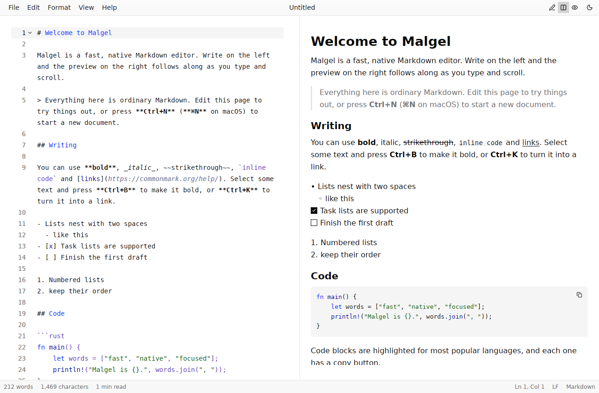
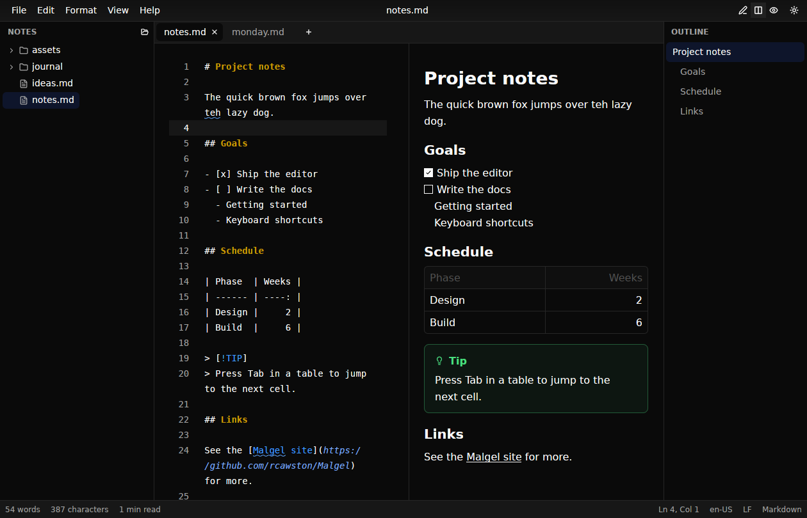
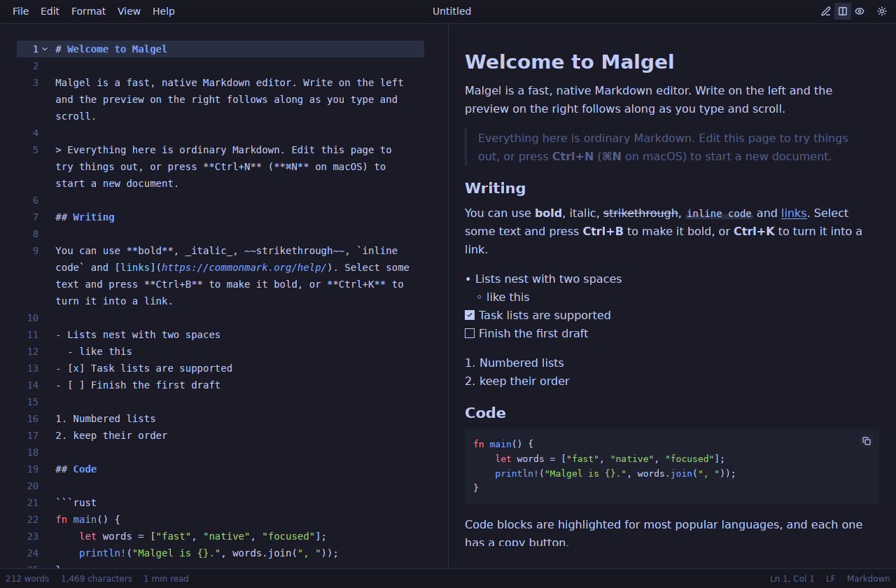
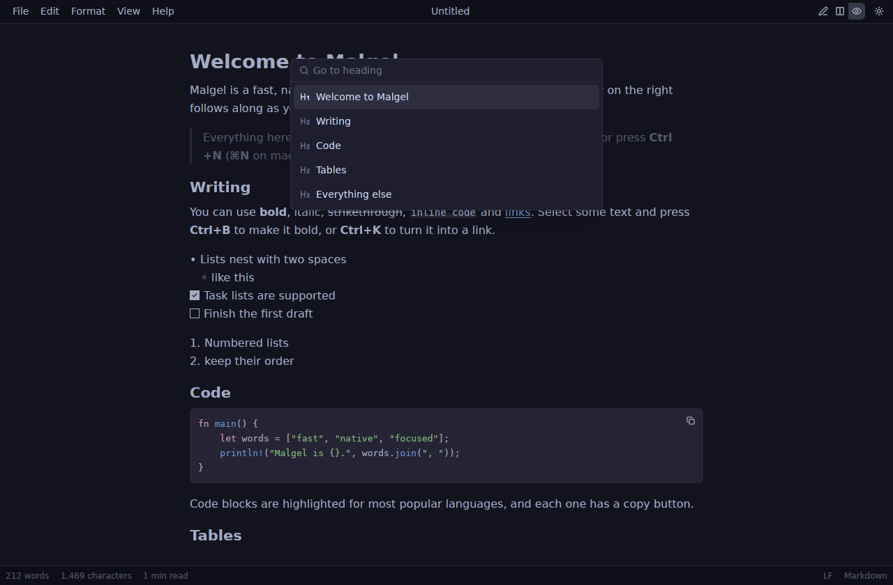
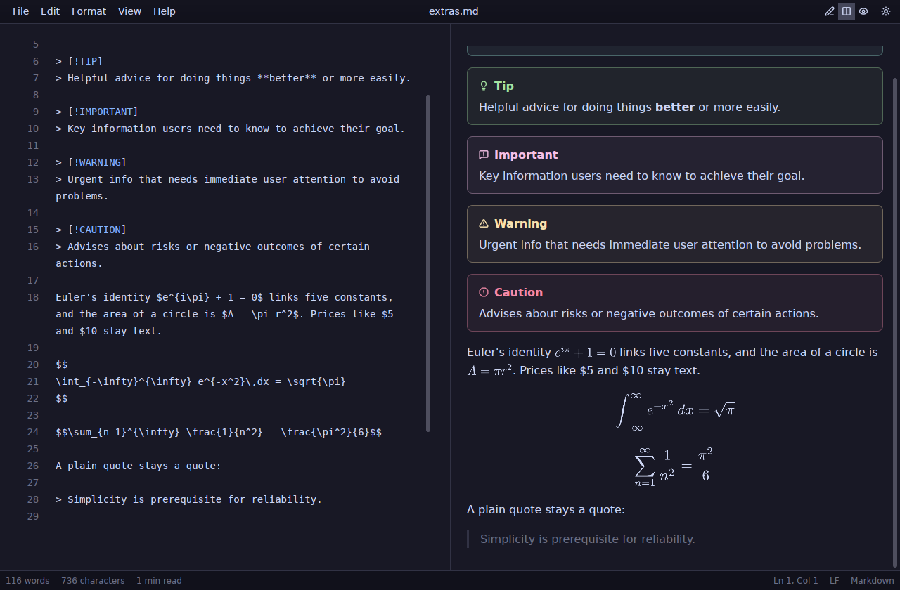

# Malgel

A fast, native Markdown editor and previewer written in pure Rust with
[GPUI Kit](https://github.com/longbridge/gpui-kit) (GPUI + GPUI Component).



## Features

- **Editor and preview side by side.** A syntax-highlighted Markdown editor
  (tree-sitter) with line numbers, soft wrap, multi-cursor editing,
  find & replace and undo history, next to a live GitHub-flavored preview.
- **Two-way scroll sync.** Scroll or type in the editor and the preview
  stays on the same block; scroll the preview and the editor follows to the
  matching source line. Whichever pane you are pointing at or typing in
  leads, so the two never fight.
- **Three layouts.** Editor only, editor and preview, or preview only
  (Ctrl+1/2/3). Single-pane layouts center a comfortable reading column.
- **Rich preview.** Tables, task lists, strikethrough, fenced code with
  highlighting for 28 languages and a copy button, YAML front matter shown as
  a property list, local images (relative to the document), remote images
  and `data:` URLs.
- **GitHub alerts.** `> [!NOTE]`, `[!TIP]`, `[!IMPORTANT]`, `[!WARNING]` and
  `[!CAUTION]` render as themed callouts.
- **Math.** LaTeX formulas, inline (`$…$`) and display (`$$…$$`), are
  typeset in pure Rust: LaTeX is translated to Typst math and laid out by the
  Typst compiler with its bundled New Computer Modern Math font. Formulas sit
  on the text baseline, follow the theme's text color, render on a background
  thread and are cached. Prices like "$5 and $10" stay text.
- **Mermaid diagrams.** A code block fenced as `mermaid` becomes a diagram —
  flowcharts, sequence, class, state and ER diagrams, Gantt charts, pies,
  mindmaps, git graphs, timelines, journeys and more — drawn in pure Rust by
  [merman](https://github.com/Latias94/merman), with no browser or
  JavaScript. Diagrams take their colors from the current theme, render in
  the background in a few milliseconds, and a mistake shows the parser's
  message under the source instead of a blank.
- **Formatting commands.** Bold, italic, strikethrough, inline code, links,
  headings, quotes, bulleted/numbered/task lists and code blocks — each
  toggles, and works on the selection or the word under the caret.
- **Structure that follows the keyboard.** Enter continues a list item, task
  or quote, and ends the list on an empty item; Tab and Shift+Tab nest and
  un-nest items with their children; numbered lists renumber themselves.
  In tables, Tab and Shift+Tab move between cells and keep the columns
  aligned, Enter adds a row, and Format → Tidy table aligns one on demand.
- **Smart paste.** Paste or drop an image and Malgel saves it in an `assets`
  folder next to the document and links it; paste a URL over selected text
  to link the text.
- **Copy as rich text** (Ctrl+Alt+C). The selection, or the whole document,
  goes on the clipboard as formatted HTML (inline styles, formulas and local
  images embedded) for mail, word processors and web editors, with the
  Markdown as the plain-text alternative.
- **Go to heading.** An outline palette (Ctrl+Shift+O) jumps to any heading.
- **Documents done right.** Atomic saves, UTF-8 with byte-order-mark
  handling, CRLF files stay CRLF, unsaved-changes prompts on new, open,
  close and quit, recent files, drag and drop to open.
- **Nothing lost.** Unsaved changes are written aside a second after you
  stop typing and come back after a crash. Files changed by another program
  reload by themselves, or, when you have unsaved edits, Malgel asks which
  version to keep; a file moved or deleted underneath you stays open as
  unsaved. The last session — documents, caret positions, folder and window
  — reopens on launch.
- **Export as HTML, PDF and Word.** All three render alerts, math and
  diagrams as the preview does, embed local images, and work offline.
  - *HTML*: a standalone, self-styled page that follows the reader's
    light/dark preference, with formulas and diagrams embedded as SVG. Raw
    HTML in the source is escaped.
  - *PDF*: typeset by the Typst compiler, in-process: Libertinus Serif body
    text, vector math and diagrams, footnotes, repeating table headers, and installed
    fonts as a fallback for CJK, emoji and other scripts. Paper follows the
    system locale: US Letter where it's standard, A4 elsewhere.
  - *Word (.docx)*: real heading styles (so the navigation pane works), Word
    lists and footnotes, tables with repeating headers, code blocks and
    alerts as shaded boxes, and formulas and diagrams as high-resolution
    images (formulas aligned to the text baseline).
- **Themes.** Light, dark or follow the system, with bundled themes (Ayu,
  Catppuccin, Everforest, Flexoki, Gruvbox, macOS Classic, Solarized,
  Tokyo Night) selectable separately for light and dark.
- **Zoom.** Ctrl+= / Ctrl+- scale the entire interface, not just the text.
- **Live statistics.** Words (CJK-aware), characters, reading time, caret
  position and selection size in the status bar.

### Optional features

Out of the box Malgel is a focused single-document editor. Everything below
is off until turned on in **Settings** (Ctrl+, — the Edit menu on Linux and
Windows, the Malgel menu on macOS) or the View menu:

- **Tabs.** Open documents side by side; Ctrl+Tab and Ctrl+Shift+Tab switch
  between them. Without tabs, opening a file replaces the current one.
- **File sidebar** (Ctrl+Shift+B). A folder's Markdown and text files as a
  tree that follows changes on disk; File → Open folder… picks the folder.
- **Outline** (Ctrl+Alt+O). The document's headings beside the editor, with
  the section you are in highlighted; click one to jump there.
- **Spell check.** Unknown words are underlined in prose (code, math, URLs
  and front matter are skipped); right-click one for suggestions or to add
  it to your dictionary. American English is built in; any installed
  Hunspell dictionary works too (see [Settings](#settings)).
- **Focus mode** (Ctrl+Shift+F, Esc to leave). Only the text, larger and
  centered, with everything but the current paragraph faded.



| Tokyo Night | Outline palette on Catppuccin Mocha |
| --- | --- |
|  |  |



## Performance

- The editor is GPUI Component's rope-backed code editor: edits, layout and
  painting touch only the visible lines, so typing stays instant in
  multi-megabyte files.
- The preview parses on a background thread; bursts of keystrokes are
  coalesced into one parse, and only the visible blocks are laid out and
  painted (virtualized list).
- Scroll sync maps top-level blocks to source lines. Lines scrolled far out
  of view are reached by an estimated jump that is corrected on the next
  frame, once the target line is laid out.
- Statistics, the heading outline and the scroll-sync index are computed in
  one debounced background pass; results from stale revisions are dropped.
- The UI redraws only when state changes. The one periodic job is checking
  open files for outside changes every two seconds — a metadata read per
  file, with contents read only when the file changed.
- Spell checking runs on a background thread after typing pauses, and only
  on prose.

On a software-rendered Linux VM the window appears in about 150 ms, and
typing into a 1.5 MB document keeps pace with the keyboard.

## Install

Download Malgel from the
[releases page](https://github.com/rcawston/Malgel/releases):

- **macOS 11+** (Apple silicon and Intel): open the `.dmg` and drag Malgel
  to Applications.
- **Windows 10+:** run the `-setup.exe` installer, which also adds Malgel to
  "Open with" for Markdown files, or unzip the portable `Malgel.exe`.
- **Linux x86_64:** make the `.AppImage` executable and run it, or unpack the
  tarball into `~/.local`:
  `tar -xzf malgel-*-linux-x86_64.tar.gz -C ~/.local --strip-components=1`.

Builds made without signing certificates are unsigned (ad-hoc signed on
macOS); [docs/RELEASING.md](docs/RELEASING.md) explains how to open them.

## Building

Malgel needs a recent stable Rust toolchain (developed with Rust 1.98; 1.94
is too old for GPUI).

On Linux, install the libraries GPUI needs first (Ubuntu/Debian):

```sh
sudo apt install libfontconfig-dev libwayland-dev libxkbcommon-x11-dev \
  libx11-xcb-dev libssl-dev libzstd-dev libvulkan1
```

Then:

```sh
cargo run --release                 # opens the welcome document
cargo run --release -- notes.md     # opens a file
```

GPUI Kit supports macOS, Linux (Wayland and X11) and Windows. CI builds and
tests Malgel on all three; it has been exercised mostly on Linux.

`packaging/` holds the app icon and the macOS, Windows and Linux packaging.
Pushing a `v*` tag builds the installable packages and publishes a release;
see [docs/RELEASING.md](docs/RELEASING.md), which also covers code signing.

## Keyboard shortcuts

Ctrl is ⌘ on macOS.

| Command | Shortcut |
| --- | --- |
| New, Open…, Save, Save as… | Ctrl+N, Ctrl+O, Ctrl+S, Ctrl+Shift+S |
| Export as HTML… | Ctrl+Shift+E |
| Copy as rich text | Ctrl+Alt+C |
| Close (tab, or window without tabs), Close window, Quit | Ctrl+W, Ctrl+Shift+W, Ctrl+Q |
| Next / previous tab | Ctrl+Tab / Ctrl+Shift+Tab |
| File sidebar, Outline, Focus mode | Ctrl+Shift+B, Ctrl+Alt+O, Ctrl+Shift+F |
| Settings | Ctrl+, |
| Editor / Editor and preview / Preview | Ctrl+1 / Ctrl+2 / Ctrl+3 |
| Go to heading… | Ctrl+Shift+O |
| Find…, Replace… | Ctrl+F, Ctrl+H |
| Bold, Italic, Strikethrough | Ctrl+B, Ctrl+I, Ctrl+Shift+X |
| Inline code, Link, Code block | Ctrl+E, Ctrl+K, Ctrl+Shift+C |
| Heading 1–6 | Ctrl+Alt+1 … Ctrl+Alt+6 |
| Quote, Bulleted, Numbered, Task list | Ctrl+Shift+., Ctrl+Shift+8, Ctrl+Shift+7, Ctrl+Shift+9 |
| Zoom in / out / actual size | Ctrl+=, Ctrl+-, Ctrl+0 |
| Switch light and dark | Ctrl+Shift+L |

In lists and tables, Enter, Tab and Shift+Tab continue, nest and move
between cells as described above; Shift+Enter always inserts a plain line
break.

## Settings

Preferences (appearance, themes, zoom, layout, the optional features,
wrapping, line numbers, scroll sync and recent files) are saved
automatically to `settings.json` in Malgel's folder:

- Linux: `$XDG_CONFIG_HOME/malgel` (usually `~/.config/malgel`)
- macOS: `~/Library/Application Support/Malgel`
- Windows: `%APPDATA%\Malgel`

Set `MALGEL_CONFIG_DIR` to use another folder. The same folder holds
`session.json` (the last session), `recovery/` (unsaved changes, removed
once saved or discarded), and `dictionary.txt` (words you added). Put
Hunspell dictionaries (`xx_YY.aff` and `xx_YY.dic`) in its `dictionaries/`
folder to check other languages; on Linux the system's Hunspell
dictionaries and on macOS those in `~/Library/Spelling` are found too.
`image_folder` in `settings.json` changes where pasted images go
(default `assets`).

## Project layout

| Path | Purpose |
| --- | --- |
| `src/main.rs` | Startup: GPUI Kit, HTTP client for images, themes, key bindings, menus, window |
| `src/workspace.rs` | The window: title bar, tabs, sidebars, status bar, settings, file commands, watching files, the session |
| `src/document_view.rs` | One document: editor and preview, scroll sync, smart keys and paste, spelling, focus mode, recovery |
| `src/smart_edit.rs` | List continuation and nesting, table navigation and tidying, paste as link — pure and tested |
| `src/file_tree.rs` | The file sidebar |
| `src/spell.rs` | Spell checking of prose with Hunspell dictionaries |
| `src/session.rs` | The last session and recovered unsaved changes |
| `src/rich_copy.rs` | Copy as rich text |
| `src/analysis.rs` | Background statistics, outline and block index |
| `src/format.rs` | Formatting commands as pure, tested text transforms |
| `src/document.rs` | Loading and atomically saving files, line endings |
| `src/export.rs` | HTML export, and HTML for the clipboard |
| `src/pdf.rs` | PDF export: Markdown → Typst markup → PDF |
| `src/docx.rs` | Word export |
| `src/typst_world.rs` | The sandboxed Typst environment shared by math and PDF export |
| `src/images.rs` | Resolving and loading image URLs relative to the document |
| `src/preview_ext.rs` | Preview plugins: GitHub alerts, block and inline math, Mermaid diagrams |
| `src/math.rs` | LaTeX → Typst → SVG/PNG formula rendering |
| `src/diagram.rs` | Mermaid diagrams, themed, as SVG any renderer can draw |
| `src/menus.rs`, `src/actions.rs` | Menus, actions and key bindings |
| `src/settings.rs`, `src/themes.rs` | Preferences and theme application |
| `build.rs`, `packaging/` | Windows exe icon and version info; app icon, bundles and installers |

Run the tests with `cargo test`.

## Acknowledgements

Built on [GPUI](https://www.gpui.rs) from Zed Industries and
[GPUI Kit](https://github.com/longbridge/gpui-kit) by Longbridge. The bundled
themes in `themes/` come from GPUI Kit and are licensed under Apache-2.0.
The bundled American English dictionary in `dictionaries/` is from
[SCOWL](http://wordlist.aspell.net/) via
[wooorm/dictionaries](https://github.com/wooorm/dictionaries); its license
is in `dictionaries/en_US-LICENSE.txt`.
Mermaid diagrams are drawn by [merman](https://github.com/Latias94/merman), a
Rust implementation of [Mermaid](https://mermaid.js.org/) (both MIT).
